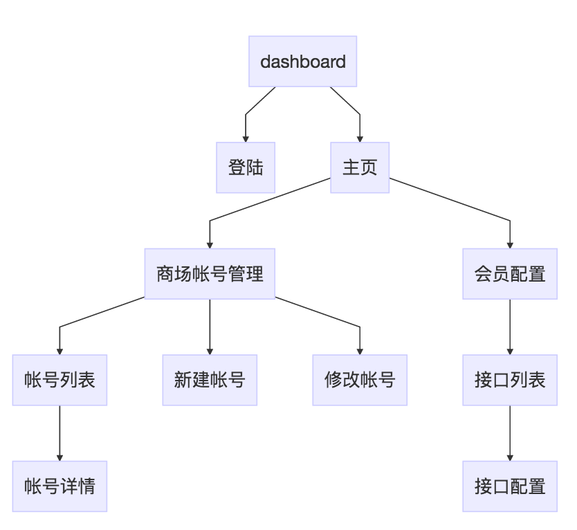
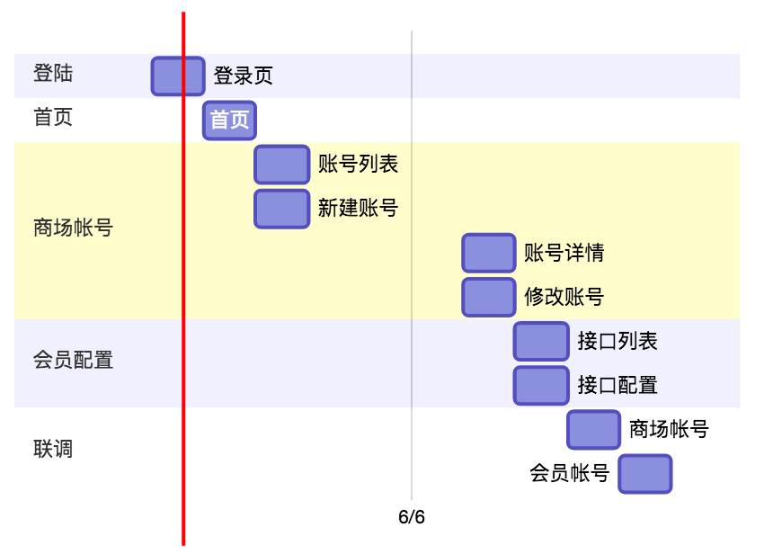

# 管理后台V0
## 项目说明
1. 相关业务管理后台
2. [dashboard.rtmap.com](https://dashboard.rtmap.com)

## 功能结构

```
graph TB
dashboard-->登陆
dashboard-->主页
主页-->商场帐号管理
商场帐号管理-->帐号列表
帐号列表-->帐号详情
商场帐号管理-->新建帐号
商场帐号管理-->修改帐号
主页-->会员配置
会员配置-->接口列表
接口列表-->接口配置
```
## 开发排期

```
gantt
dateFormat MM-DD
section 登陆
登录页: 06-01, 1d
section 首页
首页: 06-02, 1d
section 商场帐号
账号列表: 06-03, 1d
新建账号: 06-03, 1d
账号详情: 06-07, 1d
修改账号: 06-07, 1d
section 会员配置
接口列表: 06-08, 1d
接口配置: 06-08, 1d
section 联调
商场帐号: 06-09, 1d
会员帐号: 06-10, 1d
```
## 开发环境
### bootstrap
[bootstrapV4](http://v4-alpha.getbootstrap.com/)
### 本地服务
需要修改本地res.rtmap.com开发服务器目录地址**adminsys**
1. /Applications/XAMPP/etc/extra/httpd-vhosts.conf
```
<VirtualHost *:80>
        DocumentRoot "/Users/wangxiang/projects/rtmap/adminsys"
        ServerName "res.rtmap.com"
        ErrorLog "logs/test-error.log"
        <Directory "/Users/wangxiang/projects/rtmap/adminsys">
                Options Indexes FollowSymLinks Includes ExecCGI
                AllowOverride all
                Order allow,deny
                Allow from all
        </Directory>
</VirtualHost>
```
2. /Applications/XAMPP/etc/httpd.conf
需要修改本地res.rtmap.com开发服务器目录地址**adminsys**
```
DocumentRoot "/Users/liuyu/work/adminsys"
<Directory "/Users/liuyu/work/adminsys">
```
